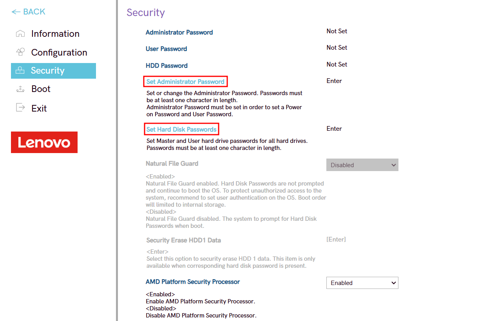
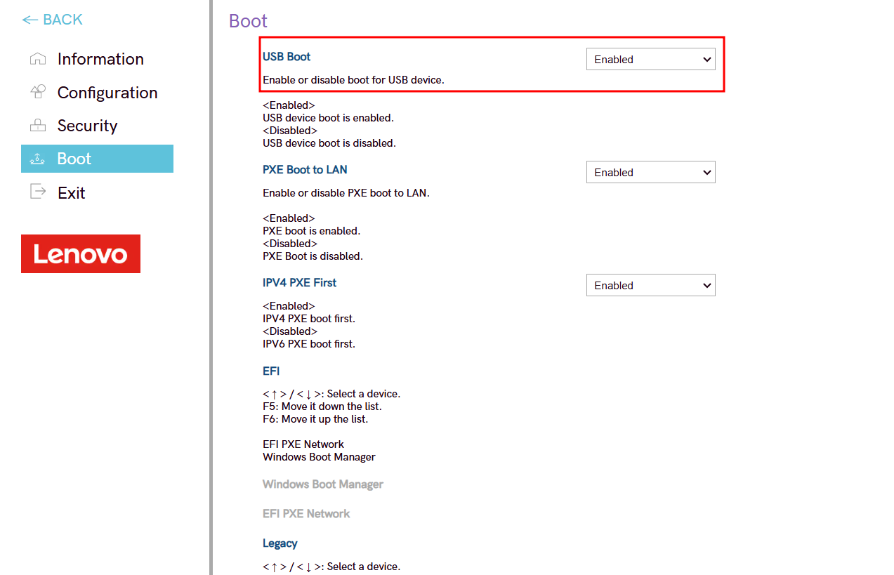

author: Alejandro González Benítez
summary: Bastionado de una BIOS
id: bastionado-bios
categories: codelab,markdown
environments: Web
status: Published
feedback link: Un enlace en el que los usuarios puedan darte feedback (quizás creando un issue en un repositorio de git)

# Bastionado de una BIOS

## Introducción
Duration: 0:01:00

En este Colab profundizaremos sobre como acceder y bastionar la BIOS/UEFI del ordenador que estamos utilizando. Para este bastionado usaremos la BIOS del Lenovo Legion 5 15APH9.

A continuación se encuentra un resumen de los puntos que veremos en este tutorial :

- Cómo configurar la contraseña de administración de la BIOS y del disco duro
- Cómo deshabilitar el arranque vía USB
- Cómo cambiar el orden de arranque del sistema

## Requisitos previos
Duration: 0:02:00

Para llevar a cabo las configuraciones se necesita acceder a la BIOS del equipo.

Accedemos a la BIOS del equipo, siguiendo estos pasos:

- Reiniciamos o encendemos el equipo.

- Inmediatamente después de encender el equipo, presionamos repetidamente la tecla F2.
  Es importante que comiencemos a presionar la tecla rápidamente después de encender el portatil.
Continuamos presionando F2 hasta que ingresemos a la pantalla de configuración de la BIOS/UEFI.

## Configuración de contraseñas
Duration: 0:02:00

Para configurar la contraseña de administración de la BIOS y del disco duro, entramos la configuración de la BIOS presionando el botón "More Setting".

Una vez dentro entramos en el apartado "Security" y seteamos las contraseñas de administración de la BIOS y del disco duro pulsando en las opciones "Set Administration Password" y "Set Hard Disk Password" respectivamente.

## Configuración de arranque vía USB
Duration: 0:02:00

Una buena opción para mejorar la seguridad de nuestro equipo es deshabilitar el arranque del equipo vía USB. Esto hace que no pueda realizarse ningún acceso no autorizado utilizando dispositivos USB bootables para extraer información sensible o instalar software malicioso.

Para deshabilitar el arranque del equipo vía USB, entramos en el apartado "Boot" de la configuración de la BIOS y cambiamos la opción USB Boot de "Enabled" a "Disabled"

## Configuración del orden de arranque del sistema
Duration: 0:02:00

Para cambiar el orden de arranque del sistema volvemos a la pantalla inicial de la BIOS y cambiamos el orden en la opción "Boot Mode".

